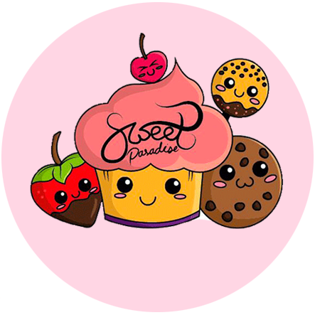

<!DOCTYPE html>
<html lang="en">
<html>
<head>
	<meta charset="utf-8">
	<title>Sweet Paradise</title>
	<meta name="viewport" content="width=device-width, user-scalable=no, initial-scale=1.0, maximum-scale=1.0, minimum-scale=1.0">
	<link rel="stylesheet" href="style.css">
	<link rel="stylesheet" href="estilos.css">
	<link rel="stylesheet" href="fonts.ss">
	<meta name="description" content="Tenemos los mejores diseños Web personalisados hechos a la medida de tus necesidades, todos nuestras paginas son responsive y https ¡ven a conocer nuestros diseños">
	<meta name="viewport" content="width=device-width, initial-scale=1">
	<link rel="stylesheet" type="text/css" href="style.css">
	<link rel="stylesheet" href="https://code.jquery.com/ui/1.11.4/themes/smoothness/jquery-ui.css">
	
	
	<link href="css/animate.css" rel="stylesheet"/>
	<link href="css/waypoints.css" rel="stylesheet"/>
	
	
	<link href="https://maxcdn.bootstrapcdn.com/font-awesome/4.7.0/css/font-awesome.min.css" rel="stylesheet" integrity="sha384-wvfXpqpZZVQGK6TAh5PVlGOfQNHSoD2xbE+QkPxCAFlNEevoEH3Sl0sibVcOQVnN" crossorigin="anonymous">

</head>
<body>
		
	<header>
		

			<a href="#" class="bt-menu">Menu</a>
		

		<nav>
			<ul>
				<li><a href="SweetParadise.html">Inicio</a></li>
				<!--<li><a href="Servicios.html">Servicios</a></li-->
				<li><a href="QuienesSomos.html">Quienes somos?</a></li>
				<li><a href="Contacto.html">Mandanos un correo</a></li>
			</ul>
		</nav>
		
	</header>
	

		
	

	

		
			

				<!--h1>Sweet Paradise</h1-->
				
				

				 
					<li>S</li>
					<li>w</li>
					<li>e</li>
					<li>e</li>
					<li>t</li>
					
					<li>P</li>
					<li>a</li>
					<li>r</li>
					<li>a</li>
					<li>d</li>
					<li>i</li>
					<li>s</li>
					<li>e</li>	
				

				 
				 
				 
				 
				 
				 
				 
				 
				 
				
				 
				
			

			
		

		

		<a href="galeria/galeria.html" class="frame">Mira nuestros deliciosos postres</a>
		

				 
				 
				 

	

		

			

				

				

					
Proximamente los pasteles mas ricos que ahigas probado en tu vida, esperalos!

				

			

		

		

			

				

				

					
Los cupkates mas bonitos y sabros de Tijuana, vas a querer comertelos todos!

				

			

		

		

			

				

				

					
La mejor gelatina de queso en esta vida, tienes que probarla!

				

			

		

	

	
	
	

</body>
</html>
